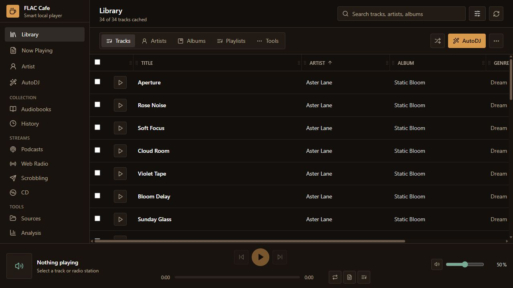
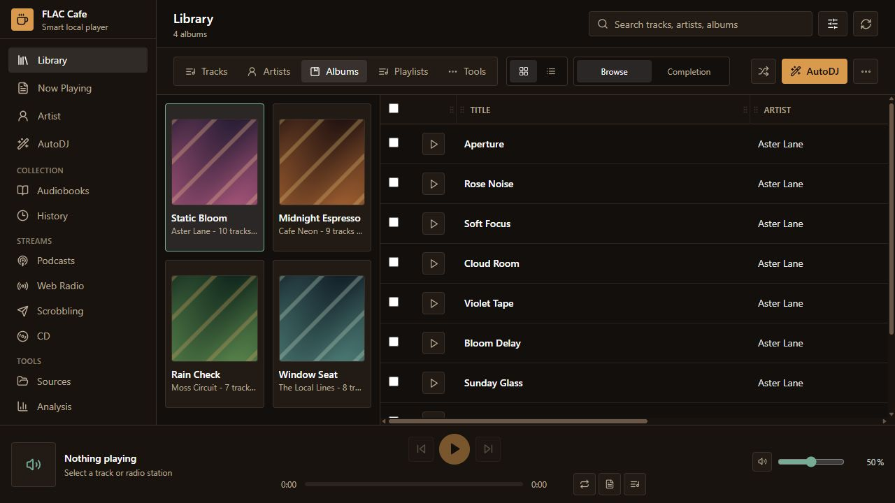
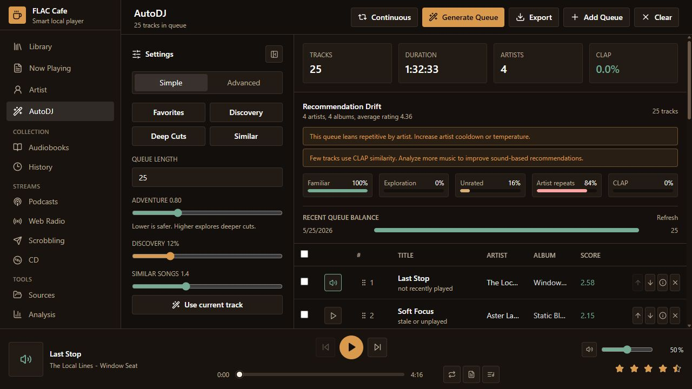
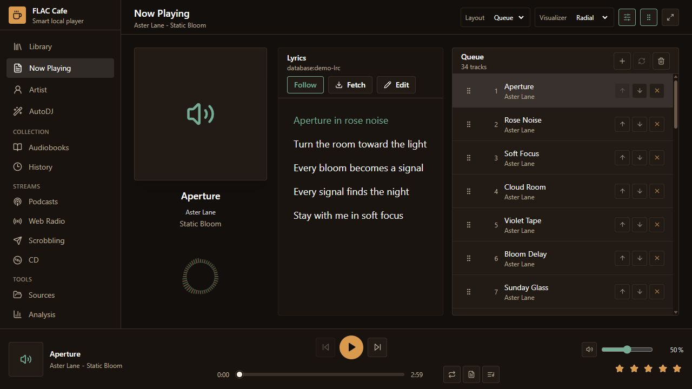
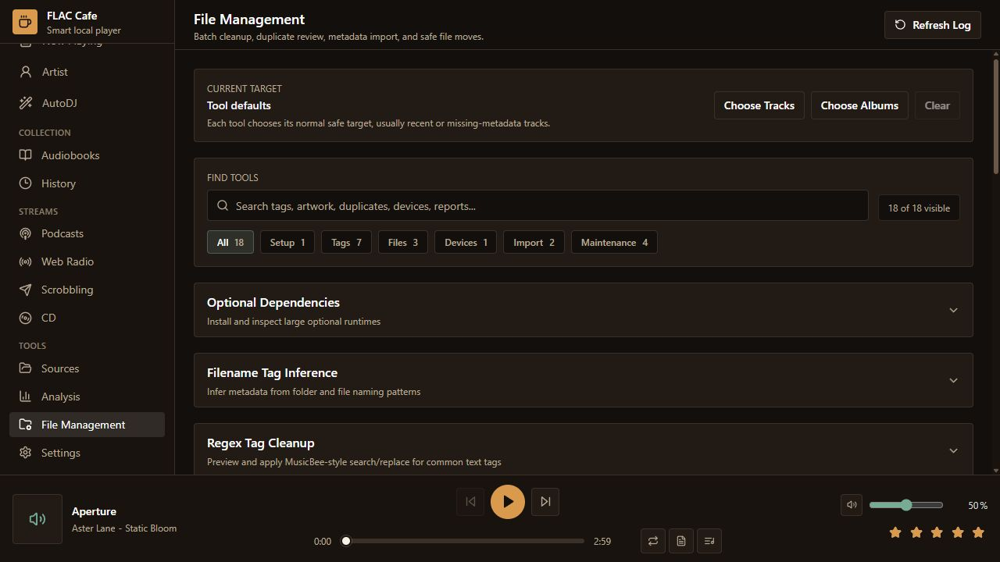

# FLAC Cafe

[](https://github.com/bsig1/flaccafe/actions/workflows/ci.yml)
[](https://github.com/bsig1/flaccafe/releases)
[](LICENSE)
[](https://github.com/bsig1/flaccafe/releases)

FLAC Cafe is an open-source, Windows-first desktop app for local music collections. It is built around a better local AutoDJ: scan downloaded files, keep ratings and play history in SQLite, analyze similarity when optional ML is installed, and generate useful queues without depending on a streaming service.

This is beta software. The core app is usable, but release builds still need broad real-library testing.

## Screenshots

These screenshots use a small demo library so the public docs do not expose a real local collection.

| Library | Albums |
| --- | --- |
|  |  |

| AutoDJ | Now Playing |
| --- | --- |
|  |  |

| File Management |
| --- |
|  |

## Download

Windows beta installers are published on the [GitHub Releases page](https://github.com/bsig1/flaccafe/releases). The app is designed for local files first; no streaming account is required.

## What Works

- Local library scanning with progress, missing-file cleanup, duplicate review, and messy metadata tolerance.
- SQLite-backed ratings, play history, playlists, lyrics, recommendation history, podcasts, audiobooks, and web radio bookmarks.
- Optional metadata and rating writes back to files when the setting is enabled.
- MusicBee-inspired library tools for filename-to-tag inference, MusicBrainz auto-tagging, acoustic fingerprints, volume tags, tag backups, CSV cleanup, file organization previews, desktop-library stats import, and cache cleanup.
- Local playback through the Tauri WebView or experimental native Rust engine, with queue controls, fade/crossfade, sleep timer, lyrics, visualizers, artist info, and media-key integration.
- AutoDJ with beginner and advanced controls, temperature sampling, cooldowns, unrated exploration, seed-track similarity, and optional CLAP audio embeddings.
- Album, artist, playlist, audiobook, podcast, radio, source-folder, history, and file-management views.
- Optional CD detection, live CD preview/playback, MusicBrainz disc lookup, and FLAC/MP3/WAV ripping workflows.
- Theme and font customization through JSON theme files plus in-app settings.
- Manifest-based extension and skin discovery for advanced customization experiments.
- MSI packaging helpers for Windows, including bundled Chromaprint and CD helper tools.

## Stack

- Desktop shell: Tauri v2
- Frontend: React, TypeScript, Vite, Tailwind CSS
- Backend: Python, FastAPI, mutagen, SQLite, with Rust native SQLite fast paths for common desktop flows
- Optional analysis: CLAP through Transformers and Torch

The MVP started with FastAPI because it keeps music logic in Python, keeps React focused on UI state, and allows the backend to be tested independently. The desktop build now also uses Rust native commands for common SQLite reads and lightweight mutations, with FastAPI kept as the fallback and Python owner for scanning, file tag writes, online services, and optional ML.

## Repo Layout

```text
backend/       Python API, SQLite, scanner, recommender, library tools
frontend/      React/TypeScript UI, typed API clients, themes, player surfaces
src-tauri/     Tauri v2 shell, backend launcher, native commands, Windows media controls, native playback
scripts/       Windows dev, test, validation, packaging, and runtime helpers
docs/          maintainer guides, feature docs, release docs, and project structure
extensions/    sample extension/skin manifests
```

For the detailed tree, ownership notes, and ignored/generated directories, see [Project Structure](docs/project-structure.md).

## Development

Create the Python environment:

```powershell
python -m venv .venv
.\.venv\Scripts\python -m pip install -r backend\requirements.txt
```

Install frontend dependencies:

```powershell
npm install
```

Run the browser preview:

```powershell
npm run dev
```

Run the desktop shell:

```powershell
npm run desktop
```

The backend listens on `http://127.0.0.1:8765`. The Vite preview uses `http://127.0.0.1:1420`. If an old dev server is still running:

```powershell
.\scripts\stop_dev.ps1
```

## Optional CLAP Runtime

The base app does not need Torch or CLAP. From the Analysis page, use **Install CLAP** and choose CPU or NVIDIA CUDA. Packaged builds create an app-managed runtime under `%LOCALAPPDATA%\FLAC Cafe\ml-runtime`.

Manual dev install:

```powershell
# CPU Torch
.\.venv\Scripts\python.exe -m pip install torch --index-url https://download.pytorch.org/whl/cpu
.\.venv\Scripts\python.exe -m pip install -r backend\requirements-clap.txt

# NVIDIA CUDA Torch
.\.venv\Scripts\python.exe -m pip install torch --index-url https://download.pytorch.org/whl/cu128
.\.venv\Scripts\python.exe -m pip install -r backend\requirements-clap.txt
```

## Checks

```powershell
npm run check
npm run test
npm run build
Set-Location src-tauri
cargo check
```

## Packaging

```powershell
npm run package:msi
```

The Windows MSI product version must be numeric, so beta builds use a numeric Windows product version such as `0.5.0` and a release/installer label such as `0.5.0-beta`.

Before publishing, follow [docs/release-checklist.md](docs/release-checklist.md). Public beta releases should use a versioned tag such as `v0.5.0-beta` and be marked as a prerelease on GitHub.

## More Docs

- [Docs Index](docs/index.md)
- [Architecture](docs/architecture.md)
- [Project Structure](docs/project-structure.md)
- [Playback](docs/playback.md)
- [Themes](docs/themes.md)
- [Extensions And Skins](docs/extensions.md)
- [CLAP Analysis](docs/clap-analysis.md)
- [Keyboard Shortcuts](docs/keyboard-shortcuts.md)
- [Troubleshooting](docs/troubleshooting.md)
- [Testing](docs/testing.md)
- [Release Documentation Checklist](docs/release-documentation-checklist.md)
